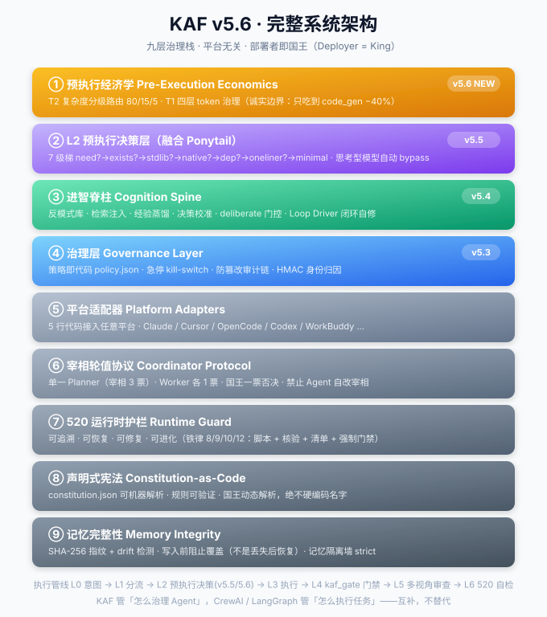

# 👑 KAF — King-Agent Framework

> **The governance layer for multi-agent swarms.**
> Give any collection of AI agents a constitution, runtime guardrails, and a clear chain of command — without locking you into one vendor or one "owner."

[](LICENSE)
[](https://www.python.org)
[](#-the-520-rule)
[](#-platform-adapters)
[](#-who-is-the-king)
[](#-architecture--nine-layers-full-stack-v56)
[](#-architecture--nine-layers-full-stack-v56)
[](https://github.com/lsjpp2/king-agent-swarm/stargazers)
[](LICENSE)
[](https://github.com/lsjpp2/king-agent-swarm/releases)

## What problem does KAF actually solve?

If you run **more than one** AI agent — coding agents (Claude Code, Cursor, OpenCode, Codex, Qwen, Kimi…), chat assistants, or CI bots — they each make decisions **independently**, with **no shared rules** about what they may touch.

That leads to predictable failure modes:

- An agent deletes or overwrites something important and there's **no record of what happened**.
- Two agents read each other's private context and **contaminate each other's reasoning**.
- When a task spans agents, **nobody owns the outcome**.
- Long-running work **drifts** away from the original intent, with no audit trail.

**Other frameworks answer "how do agents execute tasks together" (orchestration).**
**KAF answers "how do you govern agents so they stay safe, accountable, and aligned" — and it sits *under* any orchestrator you already use.**

It is not an orchestrator. It is the **constitution + runtime guardrail** layer.

---

## Why teams adopt KAF

- **Constitution-as-Code** — governance is a parseable JSON file you can diff, review, and CI-test. Not a vibe in a markdown doc.
- **Runtime guardrails (the 520 Rule)** — destructive operations are blocked at execution time (not just warned), with a real audit log.
- **Memory integrity** — private memory is isolated; shared memory is fingerprinted so unauthorized drift is detectable.
- **Platform adapters** — plug in any agent platform in ~5 lines of code. No vendor lock-in.
- **Tamper-evident audit chain** — every governance decision is hash-linked, so you can *prove* what happened.
- **Whoever deploys it is King** — the framework ships with **no hardcoded owner**. The person (or agent) who runs it is, by default, in charge.

```
Constitution-as-Code   宪法从md文档 → 可解析JSON，规则可机器验证
520 Runtime Guard      从事后检查 → 运行时强制（有原生hook走hook，无hook平台走agent侧门禁kaf_gate.py）
Memory Integrity       从"丢失后恢复" → "写入前阻止覆盖"
Platform Adapter       从绑定特定平台 → 5行代码接入任意平台
Governance Layer       v5.3 新增：策略即代码 + 急停(kill-switch) + 防篡改审计链 + 身份归因(HMAC)
Dynamic King          v5.3 新增：部署者即国王，远程复制者默认自己称王，非硬编码某用户
```

---

## 🛡️ The 520 Rule — four principles, three iron laws

Every action an agent takes must be:

| | Principle | What it means in code |
|:--|:--|:--|
| **5** | **Traceable** | Every op has a script + log entry (`kaf_operations.log`) |
| **2** | **Recoverable** | Deletes go to recycle bin; configs are backed up first |
| **0** | **Fixable** | On failure, `on_failure()` hands you rollback options |
| **+** | **Evolvable** | Good workflows auto-crystallize into reusable Skills |

**Three Iron Laws — violations are blocked at runtime, not just warned:**

- 🔒 **Law 8** — Destructive ops (`rm` / `mv` / `copy`) MUST come from a script, then be verified.
- 🔒 **Law 9** — Any number written to memory MUST be verified against the filesystem.
- 🔒 **Law 10** — Before deleting, the agent MUST show the full file list and get your confirmation.

### Live guardrail interception

```bash
$ python kaf.py guard
  pre:delete          → 铁律10：删除前展示清单+用户确认
  pre:destructive_op  → 铁律8：破坏性操作必须有脚本
  post:write_memory   → 铁律9：记忆数字实地核查
  startup             → 记忆完整性：指纹校验
```

```python
from guard520 import Guard520
guard = Guard520("constitution.json")

guard.pre_execute({"type": "rm", "target": "D:/x"})
# → block: 铁律8违规：rm 操作无脚本

guard.pre_delete({"type": "rm", "target": "constitution.json"})
# → block: 铁律10违规：未展示清单/未获确认。待删1项

guard.pre_execute({"type": "rm", "target": "D:/x", "script": "clean.py", "verified": True})
# → ok
```

**No config, no `--force`, no "are you sure?" bypass. The guard returns `BLOCK` and writes it to the log.**

---

## 🏛️ Architecture — nine layers, full stack (v5.6)



> Click any diagram to open it full-size on GitHub. All 14 are in [`diagrams/`](diagrams/).

```
┌─────────────────────────────────────────┐
│  预执行经济学(v5.6)                      │  T2 复杂度路由 80/15/5 · T1 四层 token 治理
├─────────────────────────────────────────┤
│  L2 预执行决策层(v5.5·Ponytail)          │  7级梯 need?→exists?→stdlib?→native?→dep?→oneliner?→minimal
├─────────────────────────────────────────┤
│  Cognition Spine  进智脊柱(v5.4)         │  反模式/检索注入/蒸馏/校准/deliberate/闭环(与治理层正交)
├─────────────────────────────────────────┤
│  Governance Layer  治理层(v5.3)          │  策略即代码/急停/审计链/身份归因
├─────────────────────────────────────────┤
│  Platform Adapters  平台适配器            │  5行代码接入任意平台
├─────────────────────────────────────────┤
│  Coordinator Protocol  宰相轮值协议       │
├─────────────────────────────────────────┤
│  520 Runtime Guard  运行时护栏            │
├─────────────────────────────────────────┤
│  Constitution-as-Code  声明式宪法         │
├─────────────────────────────────────────┤
│  Memory Integrity  记忆完整性             │
└─────────────────────────────────────────┘
```

Why JSON, not a markdown doc? So your constitution can be **parsed, diffed, and CI-tested** — not just read.

---

## ⚡ Quick start

```bash
git clone https://github.com/lsjpp2/king-agent-swarm.git
cd king-agent-swarm/kaf

python kaf.py init      # generate constitution.json + register memory fingerprints
python kaf.py check     # 520 self-check  →  ✅ PASS
python kaf.py verify    # memory integrity (fingerprint + drift detect)
python kaf.py status    # who's the current Prime Minister
```

**You are King by default.** The framework does not assume any specific owner. If you deploy it, you're in charge:

```bash
# 默认：当前部署者（你）即国王
python kaf.py status

# 显式指定国王（可选）
export KAF_KING=YourName        # 或 kaf_config.json 写 {"king":"YourName"}
```

Real `kaf check` output on a fresh cluster:

```
==================================================
  KAF 520 自检
==================================================
  ✅ traceable: 日志记录能力: 就绪 | 日志文件: 待生成（首次运行正常）
  ✅ recoverable: 删除操作走回收站(FOF_ALLOWUNDO)
  ✅ fixable: on_failure提供回滚方案
  ✅ evolvable: skill目录: .../.workbuddy/skills (25个skill)

  总体: PASS
```

---

## 📜 Constitution-as-Code

Your governance is a JSON file, not a vibe:

```json
{
  "version": "5.6",
  "sovereign": { "king_resolver": "deployer" },
  "governance": {
    "kill_switch": true,
    "audit_chain": true,
    "attestation": "hmac"
  },
  "guard520": { "law8_scripted": true, "law9_verify": true, "law10_confirm": true }
}
```

Diff it. Review it in PR. Test it in CI. Roll back by `git revert`.

---

## 🔄 Who is the King?

**v5.3 makes the King dynamic — `Deployer = King`.** There is no hardcoded owner.

Resolution order (`kaf/king.py:resolve_king()`):

```
KAF_KING env  >  kaf_config.json["king"]  >  local author env  >  current OS user
```

- **You deploy it** → you are King. No code change needed.
- **Someone forks and deploys it** → *they* are King. The framework never imposes a foreign owner.
- **Explicit override**: `KAF_KING=Alice` or `kaf_config.json {"king":"Bob"}`.

This is deliberate: KAF is meant to be **copied, not adopted wholesale**. Whoever runs it owns their cluster.

---

## 🧩 Platform adapters

A new platform is ~5 lines:

```python
class MyPlatformAdapter(AdapterBase):
    name = "my-platform"
    def list_sessions(self): ...
    def read_trace(self, sid): ...
```

See `adapters/` for Claude / Cursor / OpenCode / WorkBuddy / generic templates.

---

## 🗺️ Diagrams

**Governance flow** — every write action is evaluated: `kill-switch → agent attestation → 520 guard → policy`, and hash-linked to the audit chain:


**King resolution** — `Deployer = King`, no hardcoded owner:


Full set of 14 diagrams in [`diagrams/`](diagrams/) — architecture (16), memory isolation (02), PM rotation (03), governance flow (05), audit chain (06), shared state (07), king resolution (08), cognition spine (09), cognition flow (10), cognition roadmap (11), cognition full (13), loop closure (14), alignment-deepseek-harness (15), plus an offline [`index.html`](diagrams/index.html) tour.

---

## 📚 Docs

- `docs/architecture.md` — design philosophy
- `docs/principles.md` — the 520 rule in depth
- `docs/quick-start.md` — step-by-step
- `docs/faq.md` — common questions

---

## 🤝 Contributing

MIT-licensed. Fork it, deploy it, make it yours. PRs welcome — especially new platform adapters and governance policies.

---

## 📌 Version

**Current: v5.6** — nine-layer full-stack: governance layer + dynamic King (v5.3) → cognition spine (v5.4) → L2 pre-execution decision layer (v5.5) → pre-execution economics: **T2 complexity routing 80/15/5** + **T1 four-layer token governance** (v5.6). See `RELEASE_v5.6.md` for the full changelog; spec in `docs/architecture_v5.6.md`.
