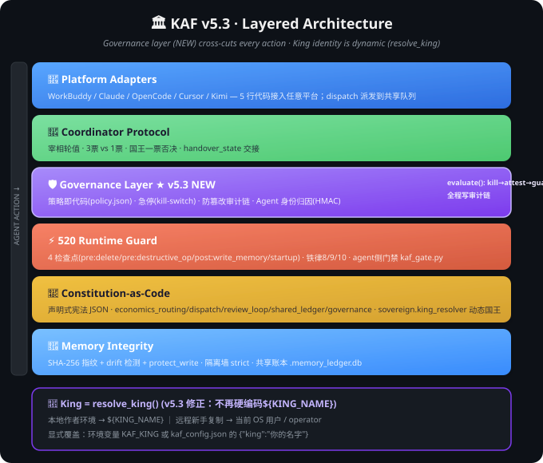
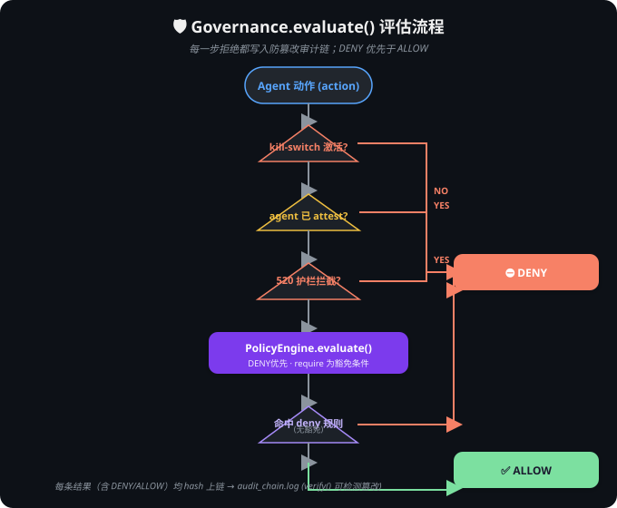
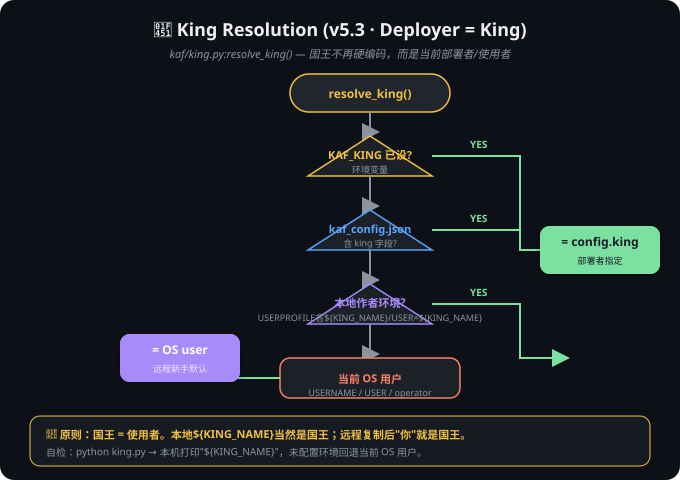

# Architecture & Design Philosophy

## Why King Agent Swarm Exists

If you have 2+ AI coding agents installed, you've hit these problems:

1. **No coordination** — each agent answers independently, often contradicting each other
2. **Memory contamination** — agent A's context leaks into agent B's conversation
3. **No clear leader** — who's responsible when a task spans multiple agents?
4. **Drift** — long-running tasks lose alignment with original intent

King Agent Swarm solves these with **convention, not code**. It's a protocol specification implemented in Markdown + JSON.

---

## Design Principles

### 1. Sovereignty (King) — whoever deploys, is King

**v5.3 makes the King dynamic: `Deployer = King`.** The framework ships with **no hardcoded owner**. The person (or agent) who deploys it is, by default, in charge, and holds absolute veto over any agent decision.

Resolution order (`kaf/king.py:resolve_king()`): `KAF_KING env > kaf_config.json["king"] > local author env > current OS user`.

**Why this matters**: Most multi-agent frameworks either make agents "democratic" (the human loses control) or hardcode a single owner (the framework can't be adopted by others). KAF is explicitly hierarchical **but owner-agnostic** — copy it, deploy it, you're King. No code change required. This is what makes it shareable, not someone's private tool.

---

## 🗺️ Diagrams (v5.3)

See `../diagrams/` for the full SVG set. The three most relevant to this document:

**Layered architecture** — Governance layer sits on top of the five classic layers; the King is resolved dynamically:



**Governance flow** — every write action passes `Governance.evaluate()`: `kill-switch → agent HMAC attestation → 520 guard → policy`, hash-linked to the audit chain:



**King resolution** — `Deployer = King`, no hardcoded owner:



---

### 2. Memory Isolation (Red Wall)

Each agent has a private memory. No agent reads another's private memory. Period.

**Shared layer** (`${CLUSTER_ROOT}/`): all agents can read/write here. Use it for:
- `coordinator.json` (who's PM)
- `progress/YYYY-MM-DD.md` (shared progress log)
- `agent-identities/` (public identity cards)

**Private layer**: each agent's own memory directory. Only that agent reads it.

### 3. Prime Minister Rotation

Instead of a fixed coordinator, the "Prime Minister" role rotates:
- King says: "X is PM now."
- Old PM hands over `handover_state`
- New PM confirms and takes over

**Why rotation, not fixed?** Different agents excel at different tasks. Let the King decide who coordinates based on the task at hand.

### 4. Conflict Resolution (Weighted Voting)

- Prime Minister: **3 votes**
- Other agents: **1 vote each**
- King: **Absolute veto** (overrides everything)

This balances efficiency (PM can decide fast) with democracy (other agents can override PM with enough votes) and human control (King can stop anything).

### 5. Anti-Drift Checkpoint

Long-running tasks (≥3 tool calls): every **5 steps**, the coordinating agent must:
1. Restate the original goal
2. Check current progress against it
3. Correct if drifting

**Why 5 steps?** Empirical — most drift happens between steps 3-7. Checking every step is too slow; checking every 10 steps is too late.

---

## Comparison with Alternatives

| Framework | Approach | King Swarm's Difference |
|:---|:---|:---|
| **RuFlo Swarm** | Homogeneous Claude Code instances, shared memory | King Swarm: heterogeneous agents, memory isolation, owner-agnostic |
| **AutoGen** | Code-level orchestration, Python-centric | King Swarm: protocol-level, platform-agnostic |
| **CrewAI** | Role-based agents with defined workflows | King Swarm: deployer-led (not workflow-driven), copy-and-own |
| **LangGraph** | Graph-based agent orchestration | King Swarm: simpler, convention-based, no graph DSL |

**King Swarm is not a replacement for these** — it's a *coordination layer* that works alongside any of them.

---

## State Model

```
[Agent Boot] → read coordinator.json → read identity → read progress → [Ready]

[Task Start] → PM assigns → agents execute → [Checkpoint @ 5 steps] → continue or correct

[Rotation Trigger] → King commands → old PM handover → new PM takes over → [Ready]
```

---

## Message Passing Model

Agents **do not** message each other directly. All coordination happens through:

1. **`coordinator.json`** — who's PM, who's in the cluster
2. **`progress/YYYY-MM-DD.md`** — shared progress log
3. **`handover_state`** — PM handover context

This avoids the "telephone game" problem where messages get distorted as they pass between agents.

---

## Security Model

- **King's commands are absolute** — no agent can override (and the King is whoever deployed the framework, by default the current OS user / deployer)
- **`coordinator.json` can only be modified by PM** (and King directly)
- **Private memory is never shared** — agents must go through shared layer
- **No agent can self-promote to PM** — only King can appoint
- **All write operations pass through the Governance layer** (v5.3) with a tamper-evident audit chain, so violations are detectable after the fact, not just blocked in the moment

---

## Limitations & Future Work

- **No direct agent-to-agent messaging** (by design, but some users may want it)
- **Rotation has never been battle-tested in production** (only simulated)
- **Anti-Drift correction mechanism is underspecified** (what exactly happens on drift?)
- **No web UI** for cluster management (CLI / file editing only)

Contributions welcome: see `CONTRIBUTING.md` (TODO).
