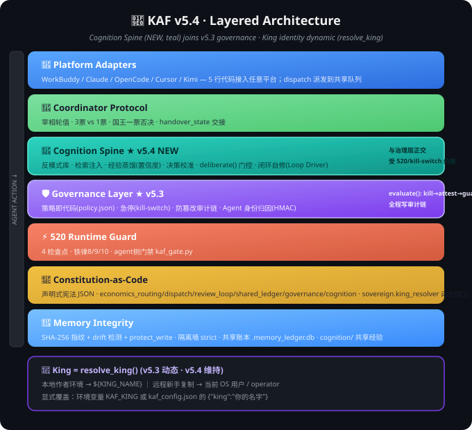
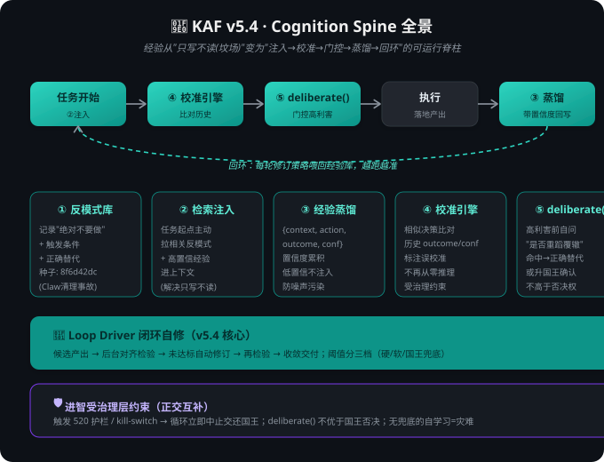
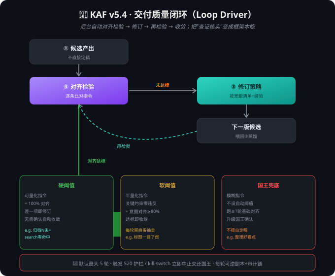

# Architecture & Design Philosophy (KAF v5.4)

> 升级自 v5.3。v5.3 把"防错"做成了代码可强制的治理层；v5.4 把"进智"做成可运行、可闭环、可对齐检验的**进智脊柱（Cognition Spine）**。
> 防错脊柱管"别蠢"，进智脊柱管"变慧"——两者正交，后者受前者约束。

---

## Why King Agent Swarm Exists

If you have 2+ AI coding agents installed, you've hit these problems:

1. **No coordination** — each agent answers independently, often contradicting each other
2. **Memory contamination** — agent A's context leaks into agent B's conversation
3. **No clear leader** — who's responsible when a task spans multiple agents?
4. **Drift** — long-running tasks lose alignment with original intent
5. **No learning** — the same mistake repeats across sessions (memory persists, wisdom doesn't)

King Agent Swarm solves these with **convention, not code**. It's a protocol specification implemented in Markdown + JSON.

---

## Design Principles

### 1. Sovereignty (King) — whoever deploys, is King

**v5.3 起 King 就是动态的：`Deployer = King`。** The framework ships with **no hardcoded owner**. The person (or agent) who deploys it is, by default, in charge, and holds absolute veto over any agent decision.

Resolution order (`kaf/king.py:resolve_king()`): `KAF_KING env > kaf_config.json["king"] > local author env > current OS user`.

**Why this matters**: KAF is explicitly hierarchical **but owner-agnostic** — copy it, deploy it, you're King. No code change required. This is what makes it shareable.

---

### 2. Cognition Spine (v5.4 NEW) — 进智脊柱

**v5.3 的"可进化"是假的**：它把经验封装成 skill，但运行时**只写不读**——经验沉进坟场，同类错误照犯（实证：Claw 会话清理事件 `8f6d42dc`，数据零丢失，但一刀切 / 数字反复 / 标题 bug 重复 4+ 次）。

v5.4 补上**进智脊柱**：让框架在"防错"之外真的"变慧"。它由五个零件组成，并由 **v5.4 闭环驱动器（Loop Driver）** 把"检验 → 修订 → 再检验"变成后台自动跑的交付质量闭环：

| 零件 | 作用 | 状态(v5.3) | 状态(v5.4) |
|:---|:---|:---:|:---:|
| ① 反模式库 Anti-pattern | 记录"什么绝对不要做" + 触发条件 + 正确替代 | ✗ | **✓** |
| ② 检索注入 Retrieval Inject | 任务起点把相关反模式 / 经验拉进上下文 | ✗ | **✓** |
| ③ 经验蒸馏 Distillation（带置信度） | 任务收尾把成败压成结构化经验 | ✗ | **✓** |
| ④ 决策校准引擎 Calibration | 相似决策比对历史、标注误校准 | ✗ | **✓** |
| ⑤ 元认知门控 deliberate() | 高利害动作前自问"我是否重蹈覆辙" | ✗ | **✓** |
| **Loop Driver 闭环自修** | 后台自动对齐检验 → 修订 → 再检验 → 收敛 | ✗ | **✓** |

进智脊柱**不优于治理层**：触发 520 护栏 / kill-switch 立即中止，deliberate() 不高于国王否决权。

---

## 🗺️ Diagrams (v5.4)

See `../diagrams/` for the full SVG set. Three new diagrams join the v5.3 set:

**① v5.4 Layered Architecture** — 在 v5.3 六层之上新增进智脊柱层（Cognition Spine），与治理层正交：



**② Cognition Spine 全景** — 五零件 + 数据流（②注入 → ④校准 → ⑤门控 → ③蒸馏回写）：



**③ v5.4 交付质量闭环（Loop Driver）** — 候选产出 → 后台对齐检验 → 未达标自动修订 → 再检验 → 收敛交付；阈值分三档：



The v5.3 set (01-08) remains authoritative for power structure / memory isolation / rotation / governance flow / audit chain / shared state / king resolution.

---

## 3. Memory Isolation (Red Wall)

Each agent has a private memory. No agent reads another's private memory. Period.

**Shared layer** (`${CLUSTER_ROOT}/`): all agents can read/write here. Use it for:
- `coordinator.json` (who's PM)
- `progress/YYYY-MM-DD.md` (shared progress log)
- `agent-identities/` (public identity cards)
- `cognition/` (v5.4 NEW: anti_patterns.jsonl + experience db + loop state) — shared so all agents learn from each other's mistakes

**Private layer**: each agent's own memory directory. Only that agent reads it.

---

## 4. Prime Minister Rotation

Instead of a fixed coordinator, the "Prime Minister" role rotates:
- King says: "X is PM now."
- Old PM hands over `handover_state`
- New PM confirms and takes over

**Why rotation, not fixed?** Different agents excel at different tasks. Let the King decide who coordinates based on the task at hand.

---

## 5. Conflict Resolution (Weighted Voting)

- Prime Minister: **3 votes**
- Other agents: **1 vote each**
- King: **Absolute veto** (overrides everything)

This balances efficiency (PM can decide fast) with democracy (other agents can override PM with enough votes) and human control (King can stop anything).

---

## 6. Anti-Drift Checkpoint + v5.4 闭环自修

Long-running tasks (≥3 tool calls): every **5 steps**, the coordinating agent must:
1. Restate the original goal
2. Check current progress against it
3. Correct if drifting

**v5.4 升级**：除周期性"陈述对齐"外，任务产出阶段引入**闭环自修（Loop Driver）**——后台自动把候选交付物与原始指令逐条比对，未对齐则自动修订、再比对，循环到对齐达标（或迭代上限 / 熔断）才交付最终成品。这是把 520 四象限"推理性反馈 = 查证核实"从人工习惯变成框架本能。

---

## 7. Cognition Spine 五零件（详述）

### ① 反模式库（Anti-pattern Library）
记录"什么绝对不要做"——每条含 `pattern`（错误行为）、`trigger`（触发条件）、`correct`（正确替代）、`source`（出处，如某次事故会话 id）。种子来自 Claw 会话清理事件（`8f6d42dc`）：一刀切判备份、数字未实地核查、只改 title 未改 custom_title 致左列不显。

### ② 检索注入（Retrieval Inject）
任务起点，把与当前上下文相关的反模式 + 高置信度经验**主动拉进上下文**。解决"经验只写不读"——这是 v5.4 让经验真正生效的关键链路。

### ③ 经验蒸馏（Distillation, 带置信度）
任务收尾，把成败压成结构化经验 `{context, action, outcome, confidence}`。置信度随被复核次数累积；低置信度经验默认不注入，防噪声污染。

### ④ 决策校准引擎（Calibration Engine）
当新决策与历史经验 `context` 相似度 > 阈值，拉出历史 `outcome / confidence`，标注本次是否"误校准"（与历史成功路径偏离）。相似决策不再从零推理。

### ⑤ 元认知门控（deliberate()）
高利害动作（删 / 移 / 覆盖 / 对外发送）前，自问"我是否正重蹈某条反模式"。命中则强制走正确替代或升国王确认。不优于 520 护栏 / 国王否决。

---

## 8. v5.4 交付质量闭环（Loop Driver，详述）

> 用户定义（2026-08-07）：v5.4 要"学会后台自动检验结果有没有对齐指令，并根据检验结果进一步修订、修正交付结果，以此循环，交付最终成品"。

1. **产出候选**：任务主体执行完毕，先交一版候选交付物（**不直接定稿**）。
2. **对齐检验（④ 升级为对齐检验器）**：后台把候选物与**原始指令 / 验收标准**逐条比对，输出"对齐度"评分 + 差距清单。
3. **修订（③ 经验蒸馏供给策略）**：若对齐度未达阈值，按差距清单 + 历史经验自动生成修订，产出下一版候选物。
4. **再检验**：回到第 2 步重新跑对齐检验。
5. **收敛交付**：对齐度达标（或触及迭代上限）→ 交付最终成品；全过程留痕、可回滚。

**关键约束**：
- **后台自动**：不阻塞用户，到达对齐阈值或迭代上限才停。
- **迭代上限 + 熔断**：默认最大 5 轮，防空转；任一轮触发 520 护栏 / kill-switch 立即中止。
- **对齐度阈值（国王已确认，2026-08-07）** 分三档：
  1. **硬阈值（可量化指令）**：含明确可测指标（如"归档 N 条且均经 conversation_search 零命中"）= 100% 对齐，差一项即修订，无需人工确认自动收敛。
  2. **软阈值（半量化指令）**：有方向缺精确指标（如"标题要一目了然"）= 关键约束零违反 + 主要意图对齐 ≥ 80%，达标即收敛、每轮留痕备国王抽查。
  3. **国王兜底（模糊指令）**：不可量化（如"整理好看点"）= 不设自动阈值，跑 ≤1 轮基础对齐后**升级国王确认**，不擅自定稿。
- **可恢复 + 循环自学习**：每轮基于上一候选物可逆副本；每一轮喂给 ③ 蒸馏，修订策略越跑越准（循环"学会"的来源）。

---

## 9. 进智与治理层的关系（关键约束）

| 维度 | 治理层（防错脊柱） | 进智脊柱（生慧） |
|:---|:---|:---|
| 目标 | 别犯不可恢复的错误 | 别重复已犯过的错误 |
| 手段 | 强制门禁 / 审计链 / kill-switch | 反模式 / 检索 / 蒸馏 / 校准 |
| 优先级 | **高**（违反即 DENY） | 低（受治理层约束） |
| 国王关系 | 国王一票否决 | deliberate() 不高于国王否决 |

**进智必须受治理层约束**：520 可恢复 → 敢试错 → 审计可追溯。没有治理层兜底的"自学习"是灾难（会自我强化错误）。两者正交互补：治理防"蠢"，进智生"慧"。

---

## State Model

```
[Agent Boot] → read coordinator.json → read identity → read progress → [Ready]

[Task Start] → ②检索注入(读①+经验库) → PM assigns → agents execute
            → [Checkpoint @ 5 steps] → restate/correct
            → 产出候选 → ④对齐检验 → 未达标? → ③蒸馏修订策略 + 重新执行 → 再检验 → 对齐达标 → 交付
            → ③经验蒸馏(写经验库,带置信度)

[Rotation Trigger] → King commands → old PM handover → new PM takes over → [Ready]
```

---

## Message Passing Model

Agents **do not** message each other directly. All coordination happens through:
1. **`coordinator.json`** — who's PM, who's in the cluster
2. **`progress/YYYY-MM-DD.md`** — shared progress log
3. **`handover_state`** — PM handover context
4. **`cognition/`** (v5.4 NEW) — shared anti-patterns + experience db, readable by all agents

This avoids the "telephone game" problem.

---

## Security Model

- **King's commands are absolute** — no agent can override (King = whoever deployed)
- **`coordinator.json` can only be modified by PM** (and King directly)
- **Private memory is never shared** — agents must go through shared layer
- **No agent can self-promote to PM** — only King can appoint
- **All write operations pass through the Governance layer** (v5.3) with a tamper-evident audit chain
- **v5.4 进智脊柱受治理层约束**：deliberate() / Loop Driver 触发 520 护栏 / kill-switch 立即中止，不绕过强制门禁；经验库写入亦须经治理评估

---

## Comparison with Alternatives

| Framework | Approach | King Swarm's Difference |
|:---|:---|:---|
| **RuFlo Swarm** | Homogeneous instances, shared memory | King Swarm: heterogeneous agents, memory isolation, owner-agnostic |
| **AutoGen** | Code-level orchestration | King Swarm: protocol-level, platform-agnostic |
| **CrewAI** | Role-based workflows | King Swarm: deployer-led, copy-and-own |
| **LangGraph** | Graph orchestration | King Swarm: convention-based, no graph DSL |
| **(v5.4 新增) 其他"可进化"框架** | 经验只写不读=坟场 | King Swarm v5.4: 反模式+检索注入+闭环自修，经验真被读、真闭环 |

King Swarm is not a replacement — it's a *coordination + cognition layer* that works alongside any of them.

---

## Limitations & Future Work

- **No direct agent-to-agent messaging** (by design)
- **Rotation has never been battle-tested in production** (only simulated)
- **v5.4 闭环自修的"对齐检验器"依赖指令可结构化**——模糊指令仍需国王兜底（见 §8 阈值三档）
- **经验库冷启动**：①反模式种子需先有人工事故沉淀，前几轮闭环质量有限（这正是 Claw 事件 `8f6d42dc` 作为首条种子的价值）
- **No web UI** for cluster management (CLI / file editing only)

Contributions welcome: see `CONTRIBUTING.md`.
