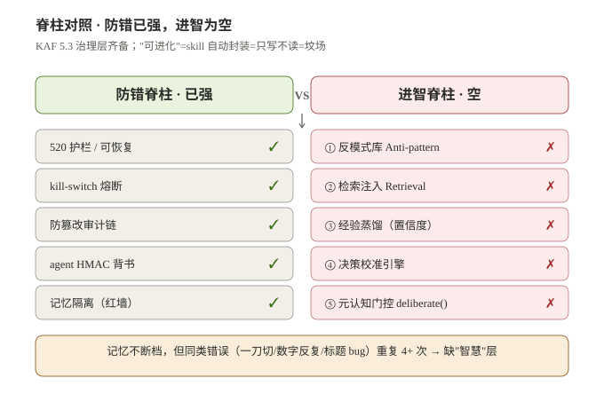
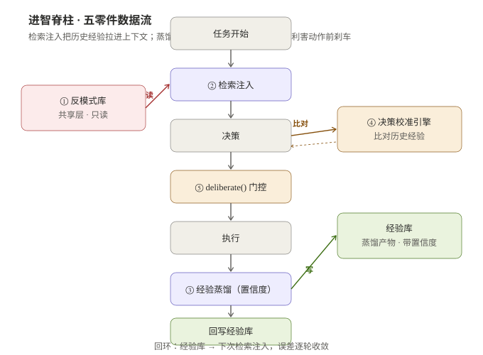
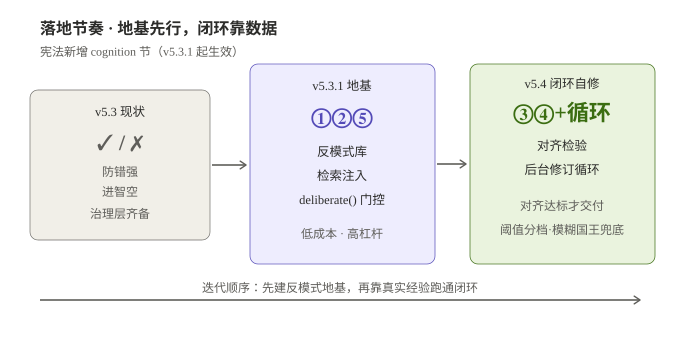

# 进智脊柱：KAF 5.3 认知层补完提案

> 提案日期：2026-08-07
> 状态：**草案**（待国王审阅；未改动 `SKILL.md` / `constitution.json` / `kaf/*.py`）
> 关联文档：`architecture.md`（六层架构）、`RELEASE_v5.3.md`（治理层 + 动态国王）、`principles.md`（各规则 Why）

---

## 0. 一句话

KAF 5.3 解决了"**不失误**"（520 护栏、kill-switch、审计链、HMAC 背书、记忆隔离），
但没解决"**更聪明**"。本文提议补一条**进智脊柱（Cognition Spine）**，
让框架从"防错框架伪装成的治理体系"升级为"既防错、又长智"的真实治理体系。

---

## 1. 动机：记忆不断档 ≠ 聪明

用户原话（2026-08-04）：

> "我们一直强调记忆不断档、不失误，但是并没有在技能框架的底层逻辑上，
> 设计一套让它怎么更'聪明'更'智慧'更'高效'的办法。"

**实证锚点 —— Claw 会话清理事件（会话 `8f6d42dc`）：**

- **防错成功**：数据零丢失，全程备份链可逆，审计可追溯（520 护栏兑现）。
- **无智慧**：同一类错误重复 4+ 次 ——
  - 一刀切误判 48 条"备份类"会话（漏掉美遇 8 条 + 湘中 1 条）；
  - 数字反复（55 / 62 / 94 几次对不上）；
  - 标题改写 uuid 手敲错 + HAND 覆盖未生效；
  - `custom_title` 未补致左列真对话不显。
- **根因**：没有"**反模式库**"在任务起点注入"这类操作历史上踩过哪些坑"，
  也没有"**元认知门控**"在高利害动作前暂停自问"我是不是在重蹈覆辙"。

结论：**防错脊柱强、进智脊柱空**是 v5.3 的结构性缺口。



---

## 2. 诊断：六层架构里的"可进化"是坟场

v5.3 自陈"可进化 = skill 自动封装"。实测：

- 封装是**只写不读** —— 经验被写进 skill，下次任务**不会被自动检索注入**；
- 没有置信度、没有回环、没有被治理层审计的"经验质量"指标；
- 结果：**可进化 = 坟场**（写进去就躺平，下次照犯同类错）。

详见图 09 对照：防错五件全 ✓，进智五件全 ✗。

---

## 3. 提案：进智脊柱五零件



| # | 零件 | 职责 | 读写 | 落地 |
|:--:|:---|:---|:---:|:--:|
| ① | **反模式库** Anti-pattern Lib | 记录"什么绝对不要做" + 触发条件 + 正确替代 | 写一次 / 读每次 | v5.3.1 |
| ② | **检索注入** Retrieval Injection | 任务起点自动把相关反模式 + 经验拉进上下文 | 读 | v5.3.1 |
| ③ | **经验蒸馏（置信度）** Distillation | 任务收尾把"什么有效"压成结构化经验 + 置信分 | 写 | v5.4 |
| ④ | **决策校准引擎** Calibration | 面对相似决策，比对历史经验、标注误校准 | 读 + 比 | v5.4 |
| ⑤ | **元认知门控** `deliberate()` | 高利害动作前暂停自问"我是否重蹈覆辙" | 门控 | v5.3.1 |

**数据流（单次任务）**：
`任务开始 → ②检索注入(读①+经验库) → 决策(④校准引擎比对) → ⑤deliberate()高利害门控 → 执行 → ③经验蒸馏(写经验库) → 回环`。

**v5.4 交付质量闭环（后台自动跑）**：
`产出候选 → ②/④对齐检验(逐条比对指令) → 未对齐? → ③蒸馏修订策略 + 重新执行 → 再检验 → 对齐达标 → 交付最终成品`。详见 §3.6。

### 3.1 ① 反模式库（Anti-pattern Library）

- **形态**：`cognition/anti_patterns.jsonl`，每条 = `{trigger, wrong, why, right, severity}`。
- **种子条目（来自 Claw 事件）**：
  - `一刀切归档`：凡标题含"备份/同步/自检"即判空 → 错；须逐条核查 + `conversation_search` 实锤。
  - `数字反复`：会话计数未实拉 SQLite 即拍脑袋 → 错；须脚本实拉后钉死。
  - `标题改写`：HAND 覆盖未生效 + 手敲 uuid → 错；须按 plan 文本匹配 + 备份还原。
- **Why**：把"踩过的坑"变成下次任务的输入，而非每次重新踩。
- **Alternative considered**：靠 520 护栏事后拦截。拒绝 —— 护栏只拦"不可逆"，拦不住"反复犯同类可逆错"。

### 3.2 ② 检索注入（Retrieval Injection）

- 任务起点（尤其 ≥3 工具调用的长任务），自动 `grep` 反模式库 + 经验库，
  把命中条以"⚠️ 历史反模式"块注入系统提示前缀。
- 与现有 `coordinator.json` / `progress/` 共享层一致：只读共享、不污染私有记忆。

### 3.3 ③ 经验蒸馏（带置信度）

- 任务收尾（与 Anti-Drift Checkpoint 同级触发），把"什么有效"压成一条经验：
  `{context, action, outcome, confidence(0-1), evidence}`。
- 置信度来源：是否被治理层审计通过、是否可逆、是否被国王/用户确认。
- **Why**：没有置信度的经验 = 噪音；带置信度才能被 ④ 加权。

### 3.4 ④ 决策校准引擎（Calibration Engine）

- 当新决策与历史经验 `context` 相似度 > 阈值，拉出历史 `outcome / confidence`，
  标注"当前方案 vs 历史最优"的偏差；高偏差且高利害 → 强制走 ⑤。
- 依赖 ③ 的数据量，故放 v5.4。

### 3.5 ⑤ 元认知门控 `deliberate()`

- 在治理层 `Governance.evaluate()` **之前**插入一道认知门：
  高利害动作（归档 / 删除 / 改标题 / 批量写）前，先问"我做过类似的吗？反模式库有命中吗？"。
- 命中反模式 → 降级为"列清单 + 等你确认"，等同 520 护栏的软刹车。
- **Why**：把"事后审计"前移到"事前自省"，成本最低。

### 3.6 v5.4 闭环自修：背景自检-修订循环（Loop Driver）

> 用户定义（2026-08-07）：v5.4 要"学会后台自动检验结果有没有对齐指令，并根据检验结果进一步修订、修正交付结果，以此循环，交付最终成品"。

这是进智脊柱的**交付质量闭环**，由 v5.4 的**循环驱动器（Loop Driver）**把 ③④ 串成一条后台自动跑的"检验 → 修订 → 再检验"流水线：

1. **产出候选**：任务主体执行完毕，先交一版候选交付物（**不直接定稿**）。
2. **对齐检验（④ 升级为对齐检验器）**：在后台把候选物与**原始指令 / 验收标准**逐条比对，
   输出"对齐度"评分 + 差距清单（哪条指令没对齐、偏差多大）。
3. **修订（③ 经验蒸馏供给策略）**：若对齐度未达阈值，按差距清单 + 历史经验自动生成修订，产出下一版候选物。
4. **再检验**：回到第 2 步，重新跑对齐检验。
5. **收敛交付**：对齐度达标（或触及迭代上限）→ 交付最终成品；全过程留痕、可回滚。

**关键约束**：
- **后台自动**：不阻塞用户、不要求逐次人工催；到达对齐阈值或迭代上限才停。
- **迭代上限 + 熔断**：设最大轮次（默认 5），防止无限空转；任一轮触发 520 护栏 / kill-switch 立即中止。
- **对齐度阈值（国王已确认，2026-08-07）**：按指令可检验程度分三档，循环驱动器据此决定"自动收敛"还是"升级人工"：
  1. **硬阈值（可量化指令）**：指令含明确可测指标（如"归档 N 条且均经 conversation_search 零命中""导出清单含 M 列字段"）。阈值 = 100% 对齐，差一项即触发修订；无需人工确认即自动收敛。
  2. **软阈值（半量化指令）**：有方向但缺精确指标（如"标题要一目了然""保护未闭环项目对话"）。阈值 = 关键约束零违反 + 主要意图对齐 ≥ 80%；未达标自动修订，达标即收敛，每轮留痕备国王抽查。
  3. **国王兜底（模糊指令）**：指令不可量化（如"整理好看点""别让我找不到"）。不设自动阈值，循环跑 ≤1 轮基础对齐后**升级为国王确认**，由国王拍板是否交付，不擅自定稿。
  - 任一层级触发 520 护栏 / kill-switch，循环立即中止并交还国王。
- **可恢复 + 循环自学习**：每轮修订基于上一候选物的可逆副本，审计链记录每一轮差异；
  每一轮又喂给 ③ 经验蒸馏，使修订策略**越跑越准**（循环的"学会"来源）。

> 一句话：v5.4 = ③④ 的"检验-修订"闭环化、后台化、自动收敛化。它把 520 四象限里"推理性反馈=查证核实"从人工习惯变成框架本能。

**实例（对照 Claw 会话清理事件）**：若 v5.4 在场，交付"归档+改名"候选后，后台对齐检验会逐条比对用户指令"真实对话全列出、备份全归档、零误判"→ 命中差距"美遇 21 条被误归档"→ 自动修订放出并改名 → 再检验"是否还有遗漏？conversation_search 是否零命中备份？"→ 对齐达标 → 交付。原本反复 4+ 次的人为返工，被收敛成一轮自动闭环。

---

## 4. 与治理层的关系（关键约束）

进智脊柱**必须受治理层约束**，否则"自动学习"会污染共享层：

- **520 可恢复 → 敢试错**：经验蒸馏只记录"可逆实验"的结论；不可逆动作不进经验库。
- **审计链 → 经验可被追责**：每条经验带 `governance_audit_ref`，质量可被回溯。
- **记忆隔离**：反模式库 / 经验库在**共享层**，但写入须经 PM / 国王；私有记忆仍不互通。
- **国王否决权覆盖进智**：`deliberate()` 的"放行"不优于 King 的绝对 veto。

> 一句话：治理防"蠢"，进智生"慧"；两者正交，进智的实验须经治理的"可恢复 + 可追溯"才合法。

---

## 5. 落地节奏



- **v5.3.1（地基，低成本高杠杆）：①②⑤**
  - 反模式库种子（来自 Claw 事件）+ 检索注入（任务起点 grep）+ `deliberate()` 门控。
  - 不动共享层结构，只在长任务起点注入、在高利害动作前加一道自省。
- **v5.4（闭环自修，需数据沉淀）：③④ + 循环驱动器**
  - 经验蒸馏 + 校准引擎，由循环驱动器串成**后台"对齐检验 → 修订 → 再检验"闭环**，对齐达标才交付最终成品。
  - 必须等 ①②⑤ 跑出足够经验量，对齐检验器才有可比基线、修订策略才够准。
- **宪法加 `cognition` 节**：把"进智须受治理约束""反模式库为共享只读""`deliberate()` 不优于国王否决"写入宪法。

---

## 6. 宪法 `cognition` 节草案

```markdown
## Article X: Cognition Spine（进智脊柱）
Rule: 框架须具备反模式库、检索注入、经验蒸馏、决策校准、元认知门控五零件；
      进智实验须经 520 护栏（可恢复 + 可追溯）方可写入共享经验层。
Why: 记忆不断档 ≠ 聪明。防错只拦"不可逆"，进智才防"反复犯同类错"。
Sub-rules:
  - 反模式库位于共享层，只读；写入须经 PM 或国王。
  - 检索注入在长任务（≥3 工具调用）起点自动执行。
  - 经验蒸馏仅记录可逆实验，带置信度与 governance_audit_ref。
  - deliberate() 门控不优于 King 绝对否决权。
```

---

## 7. 验收标准（Definition of Done）

- [ ] 反模式库存在且含 ≥3 条来自真实事件的种子。
- [ ] 长任务起点系统提示含"⚠️ 历史反模式"注入块。
- [ ] 高利害动作前 `deliberate()` 能命中反模式并降级为"列清单等确认"。
- [ ] 经验蒸馏产出带置信度的经验条目，且可被 ④ 检索。
- [ ] 进智相关写操作全部过治理层审计链（可追溯）。

---

## 8. 风险与开放问题

- **反模式误触发**：grep 命中但本次不适用 → 需 `severity` + `context` 字段细化，命中仅作"提示"非"拦截"。
- **置信度校准难**：初期数据少，置信度可能虚高 → v5.3.1 阶段故意从低置信起步。
- **`deliberate()` 开销**：每高利害动作多一轮自省，token 成本上升 → 仅对"高利害 + 可逆"动作触发，普通动作跳过。
- **与"不失误"目标张力**：进智鼓励试错，治理要求零失误。解法：进智只试"可逆"动作，不可逆仍由护栏硬拦。

---

## 9. 下一步（待国王拍板）

1. 国王确认方向（本文即方向稿）。
2. 方向 OK → 由我起草 `v5.3.1` 补丁：`cognition/anti_patterns.jsonl` 种子 + `retrieval_inject.py` + `deliberate()` 钩子 + `constitution.json` 的 `cognition` 节。
3. 跑通后在 Claw 真实长任务上验证"检索注入 / deliberate() 命中率"，再决定 v5.4 ③④ 的字段设计。
4. **全程零改动已发布文件**，所有新增均为新增文件，可逆、可回滚。
