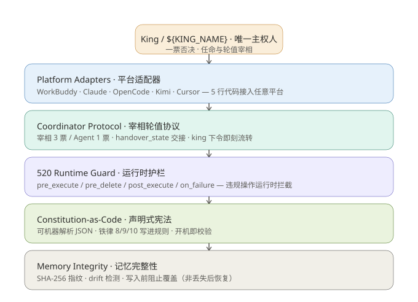

# KAF 架构文档 · v5.0

> King-Agent Framework — 多智能体治理框架
> Constitution-as-Code + 520 Runtime Guard + Memory Integrity + Platform Adapter

---

## 架构总览



国王（人类）是唯一主权人，位于治理链顶端，向下对五层架构施加约束。五层自顶向下依次为：

1. **Platform Adapters** — 平台适配器，5 行代码接入任意 Agent 平台
2. **Coordinator Protocol** — 宰相轮值协议，投票与 handover
3. **520 Runtime Guard** — 运行时护栏，违规操作拦截
4. **Constitution-as-Code** — 声明式宪法，可机器解析
5. **Memory Integrity** — 记忆完整性，写入前阻止覆盖

---

## 与 v4 的核心区别

| 维度 | v4 | v5.0 |
|:---|:---|:---|
| 宪法形态 | md 文档 | 可机器解析 JSON |
| 护栏 | 事后检查（人工） | 运行时 hook 拦截 |
| 记忆保护 | 丢失后恢复 | 写入前阻止覆盖 |
| 平台接入 | 绑定特定平台 | 适配器抽象，5 行接入 |
| 可追溯 | 靠自觉 | `kaf_operations.log` 自动记录 |

v4 是"约定"，v5.0 是"框架"。

---

## 模块说明

### constitution.json（声明式宪法）

`version: "5.0"`，包含：

- `sovereign`：国王主权（veto / amend / appoint_coordinator，irrevocable）
- `power_structure`： hierarchical，宰相 3 票、rotatable
- `memory_wall`： strict 隔离，agents 互不读私有记忆
- `rules[]`：可机器验证的规则数组（delete_auth / path_discipline / script_required / number_verify / memory_integrity），每条带 `source`（铁律8/9/10）
- `rule_520`：520 法则（traceable / recoverable / fixable / evolvable + 四象限 + 铁律8/9/10），`immutable: true`
- `anti_drift`：每 5 步对齐检查
- `open_source`：仓库与贡献流程

### coordinator.json（宰相注册表）

- `current_coordinator`：当前宰相（如 `workbuddy`）
- `coordinators{}`：每个 Agent 的 title / platform / identity_file / private_memory / votes / capabilities / status
- `rotation_history[]`：轮值记录
- `handover_protocol`：交接字段与 TTL
- `voting_rules`：宰相 3 票、Agent 1 票、国王一票否决

### guard520.py（520 运行时护栏）

4 个检查点，返回 `GuardResult(OK/BLOCK/WARN)`：

| 检查点 | 触发 | 逻辑 |
|:---|:---|:---|
| `pre_execute` | 破坏性操作 | 无脚本 → BLOCK（铁律8） |
| `pre_delete` | 删除操作 | 未展示清单/未确认 → BLOCK（铁律10） |
| `post_execute` | 所有操作 | 自动写 `kaf_operations.log` |
| `on_failure` | 操作失败 | 返回回滚方案（可恢复） |

`self_check()` 输出 520 自检（traceable/recoverable/fixable/evolvable）。

### memory_integrity.py（记忆完整性协议）

- `calculate_fingerprint()`：SHA-256 指纹
- `verify()`：启动时校验指纹
- `drift_check()`：检测未授权修改（drift）
- `protect_write()`：写入前保护检查，拦截对 520 铁律段落的覆盖
- `PROTECTED_PATTERNS`：MEMORY.md / META.md 中的不可覆盖段落（520规则/四象限/铁律8/9/10）

### kaf.py（CLI 入口）

```
kaf init      生成 constitution.json + 注册记忆指纹
kaf check     520自检
kaf verify    记忆完整性校验（指纹 + drift）
kaf guard     打印运行时护栏 hook 配置
kaf rotate X  宰相轮值
kaf status    查看集群状态
```

### adapters/（平台适配器）

- `base.py`：`PlatformAdapter` 抽象基类，7 个方法（read_constitution / read_memory / write_memory / register_hook / execute / get_agent_id / get_workspace）
- `workbuddy.py`：WorkBuddy 适配器（已实现）
- `_template.py`：新平台适配器模板

---

## 520 法则（核心，不可丢失）

| 原则 | 含义 | 工程化 |
|:---|:---|:---|
| 可追溯 | 每个操作有脚本+日志 | `kaf_operations.log` |
| 可恢复 | 删除走回收站，配置改前备份 | `FOF_ALLOWUNDO` + `.bak` |
| 可修复 | 错误可回滚 | `on_failure` 回滚方案 |
| 可进化 | 提炼工作流/铁律/skill | skill 自动封装 |

**铁律 8/9/10**：
- 铁律8：操作必须写脚本+验证
- 铁律9：记忆数字必须实地核查
- 铁律10：删除前展示清单+用户确认

> "就算世界灭亡，这个标准不能丢。"

---

## 宰相轮值流程

```
国王下令: 「从今天起 X 做宰相」
   → 旧宰相: handover_state 写入 coordinator.json
   → 新宰相: 读 coordinator.json 确认身份，开始履职
```

无冷却期，即刻生效。CLI：`python kaf.py rotate <agent_name>`

投票：宰相 3 票，其他 Agent 1 票，国王一票否决。

---

## 快速开始

```bash
cd kaf/
python kaf.py init
python kaf.py check
python kaf.py verify
python kaf.py rotate claude
```

---

## 开源

- Repo: https://github.com/lsjpp2/king-agent-swarm
- License: MIT
- 贡献：user_feedback → coordinator_evaluate → king_confirm → merge
